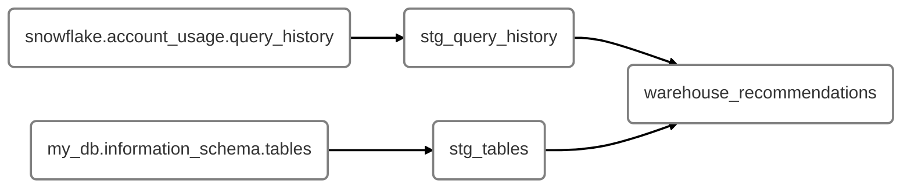

# 1. How dbt Labs tunes model performance and optimizes cloud data platform costs with dbt
You can optimize query performance without refactoring the dbt model, you simply need to pick the right warehouse size for that model, based on its past performance. The dbt model responsible for "the performance of dbt models" picks the right warehouse size for you, automatically, at model level. 

What is used:
- Snowflake query tags
- dbt models based on snowflake views
- dbt configs

dbt can put info into a snowflake query's tag, for each query dbt runs. This tag can be used for later analysis on query performance, etc. 

Set this up as early as possible, so if you need to use it in the future, the data is already there. 



Snowflake metadata views provide data on table size, query performance, etc. This information, together with the JSON tags on the queries, can be parsed in a dbt model `stg_query_history`, which relates dbt model names to snowflake queries used to create these models. `warehouse_recommendations` model aggregates query statistics for models, to provide recommendations. 

They are "dbt models" about "the performance of dbt models". 

Defined compute recommendations:
- Query efficiency is measured by spillage to local/remote storage
- Additional prescriptive recommendations based on average model execution time, table size in terms of bytes/rows. 

dbt configs example:
```sql
{{
    config(
        snowflake_warehouse = 'prod_wh_xl'
    )
}}
```
The results from the `warehouse_recommendations` model get pasted as an argument into the above configuration, which happens at the model level. When dbt invokes that model, it issues a `use warehouse ...` command for that session, for that model only. 

A dashboard can be built up on this work, to monitor effectiveness. For the models that resizing warehouse doesn't work, we can then look into refactoring them. 

In dbt Labs experiment, without any model refactoring, this method decreased 45% of run time, and reduced annual cost of $22k, because the jobs run faster, despite using a larger warehouse. 

This method can also include flagging mechanism for when a model's materialization strategy needs to be changed, such as from "table" to "incremental". 

## Appendix
The example "set_query_tag.sql" file, to create tags for model runs (copied form Elize Papineau's GitHub):
```sql


  {# These are built in dbt Cloud environment variables you can leverage to better understand your runs usage data #}
  
  
  

  {# These are built in to dbt Core #}
  
  
  
  
  

  
    
    {%- set new_query_tag = '{"dbt_environment_name": "%s", "dbt_job_id": "%s", "dbt_run_id": "%s", "dbt_run_reason": "%s", "dbt_project_name": "%s", "dbt_user_name": "%s", "dbt_model_name": "%s", "dbt_materialization_type": "%s"}'
      | format(
                dbt_environment_name,
                dbt_job_id,
                dbt_run_id, 
                dbt_run_reason,
                dbt_project_name,
                dbt_user_name,
                dbt_model_name,
                dbt_materialization_type
    ) -%}
    
    {{ log("Setting query_tag to '" ~ new_query_tag ~ "'. Will reset to '" ~ original_query_tag ~ "' after materialization.") }}
    
    {{ return(original_query_tag)}}
  
  
  
  {{ return(none) }}


```